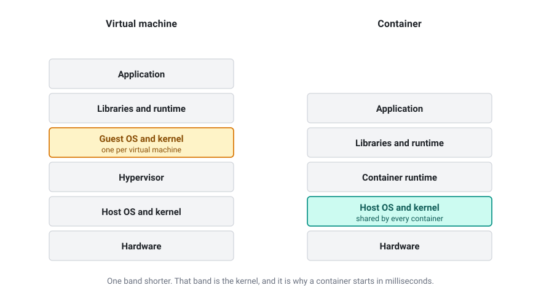
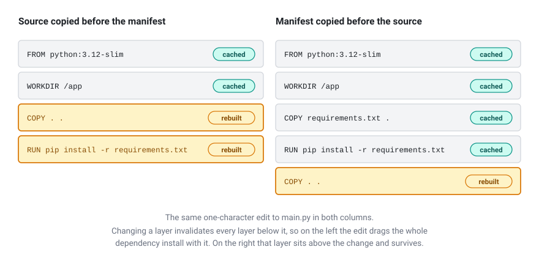
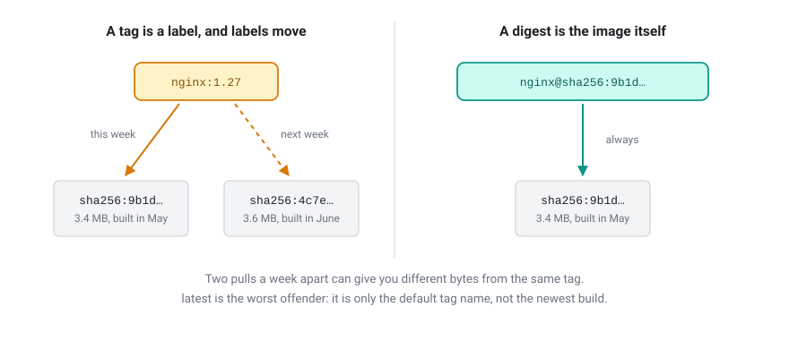
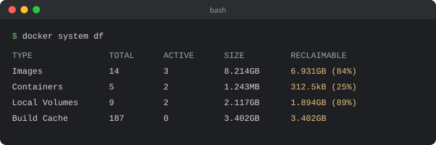

I studied Docker properly once, a few years ago. Then I barely touched it.

When I came back to it recently I was lost. Not completely lost, because I recognised the vocabulary and I could still read a Dockerfile. But lost enough that I went looking for a tutorial to get me started again. That's the second time I've done that, and both times I sat through an hour of somebody explaining what a container is when what I actually needed was ten minutes on what had changed since I was last here.

So this is the article I wanted to find instead. It's partly for anyone starting out, but mostly it's for me, in about eighteen months, when I open a project with a `docker-compose.yml` in it and realise I've forgotten how any of this works again.

## What Docker actually is

Most explanations leave you worse off than when you started. Not because they're wrong, but because they're written by people who already understand it and have forgotten what it felt like not to. You come away able to repeat a definition and unable to use anything.

The version that finally stuck for me is this.

Docker packages an application together with everything it needs to run: the libraries, the runtime, the configuration, and the application itself. All of it goes into one read-only artefact called an **image**. You hand that image to a colleague, a server or a CI runner, and it behaves the way it behaved on your machine. Start the image and you get a **container**, which is a running process walled off from the rest of the system, behaving as though it has the machine to itself.

Packaging and isolation. Everything after that is detail.

## Where the virtual machine comparison breaks

Docker usually gets explained as a lighter virtual machine. It's a useful lie, and knowing where it stops being true is worth more than the comparison itself.

A VM carries its own kernel. A container doesn't. It borrows the host's. That one difference is why a container starts in milliseconds and a VM takes a minute.



The follow-up claim, that an image contains "only your app and its dependencies", oversells it. Pull `ubuntu` or `debian` and you get most of a Linux userland: a shell, a package manager, the core utilities. What you don't get is a kernel. Images are smaller than VM disks because they leave out the kernel and share layers with each other, not because they're inherently minimal. They can be minimal if you build them that way. Most aren't.

There's an irony here that I'd never registered until I went looking. On macOS or Windows, Docker Desktop runs a Linux virtual machine on your behalf and your containers live inside it. They were never native. That VM is why reading files from a mounted host directory feels slow, and why Docker's memory usage shows up as a fixed allocation rather than whatever happens to be going spare.

## The words worth knowing

- **Image**: the read-only artefact. Built from a Dockerfile, made of stacked layers.
- **Container**: a running or stopped instance of an image.
- **Layer**: one filesystem diff, produced by one Dockerfile instruction. Cached, and shared between images.
- **Registry**: where images live. Docker Hub is one, GitHub's `ghcr.io` is another.
- **Tag**: a human-friendly label such as `:3.12`. Mutable, which matters more than you'd expect.
- **Digest**: a `sha256:` hash of an exact image. Immutable.
- **Compose**: a YAML file describing several containers and how they talk to each other.

## What changed while I was away

This is the section I actually came back for, and it's where old tutorials do the most damage, because two of the answers are no longer what they were.

**Installing it isn't one decision any more.** Docker Engine is the open source daemon and command line tool. On Linux you install it directly and there's nothing to pay, ever. It's on version 29.x at the time of writing.

Docker Desktop is the graphical bundle for macOS, Windows and Linux, and it is not unconditionally free. Under the Docker Subscription Service Agreement it's free for personal use, education, non-commercial open source, and small businesses, where small means fewer than 250 employees **and** under $10 million in annual revenue. Cross either threshold and each user needs a paid seat. Government entities need one regardless of size.

That "and" does a lot of work. A forty-person consultancy turning over $12 million needs licences. So does a three-hundred-person charity running on nothing. Docker relies largely on self-reporting, which is why organisations tend to find out during a procurement audit rather than at install time.

That clause is why a whole category of alternatives now exists. They all run the same images, because the image format is an open standard (OCI) and Docker is one implementation of it. Podman Desktop runs without a background daemon and without root, and it's free everywhere, which is why it turns up in regulated environments. Rancher Desktop, from SUSE, is open source and bundles Kubernetes as a switchable component. Colima is command line only and minimal. OrbStack is macOS only and noticeably quicker, but it has its own commercial terms, so read them before it goes on a work machine.

**Compose was rewritten.** It's `docker compose`, with a space. The hyphenated `docker-compose` was the original Python implementation, which stopped receiving updates in July 2023 and was removed from Docker Desktop in 4.23.0. This is the single most useful dating tool I've found. If a tutorial types the hyphen, it predates the rewrite, and everything else in it deserves the same suspicion.

While you're in there, delete the `version: '3.8'` line from the top of your Compose files. It's obsolete. Compose validates against the newest schema whatever you put there, and leaving it in earns you a warning on every command.

## The commands I keep re-looking-up

```bash
docker run -d --name web -p 8080:80 nginx:1.27
docker ps
docker logs -f web
docker exec -it web sh
docker stop web && docker rm web
docker images
docker compose up -d
docker compose logs -f
docker compose down
```

That's most of it. The gap between knowing those nine and being productive is smaller than the length of the average tutorial suggests.

## A Dockerfile that won't embarrass you

```dockerfile
FROM python:3.12-slim

WORKDIR /app
RUN useradd --create-home app

COPY requirements.txt .
RUN pip install --no-cache-dir -r requirements.txt

COPY --chown=app:app . .

USER app

CMD ["python", "main.py"]
```

Small file, three decisions worth explaining.

The dependencies get copied before the source code. Each instruction produces a cached layer, and changing a layer invalidates every layer below it. Copy your whole project first and a one-character edit re-runs `pip install` every single time. Copy the manifest first and the dependency layer survives until the manifest itself changes. Of everything in this article, that's the habit that saves the most time.



There's a `.dockerignore` sitting next to it. Without one, `docker build .` sends your entire working directory to the builder, including `.git`, `node_modules`, and whatever large file you've forgotten is in there. Write it on day one and treat it like `.gitignore`.

And it doesn't run as root. The default is root, and root inside a container maps to root on the host unless user namespaces are enabled. Most images ignore this. I'd rather not. Note where the user gets created: above the `COPY` lines, so the edit-invalidates-everything-below rule doesn't drag it into every rebuild, and early enough that `COPY --chown` can hand it ownership of `/app`. Create the user at the bottom instead and your files land owned by root, which is fine right up until the application tries to write a log, a cache or a SQLite file next to itself.

For anything compiled, use a multi-stage build: compile in a large image, copy the binary into a small one, ship a fraction of the size with none of the toolchain attached.

## The notes I'm keeping so I stop rediscovering them

Every time I come back to Docker I rediscover the same handful of things. So they're going here, where I can find them.

**Tags move.** `nginx:1.27` is a label pointing at an image, and the publisher can repoint it whenever they like. Two `docker pull` commands a week apart can give you different bytes. `latest` is the worst offender, because it doesn't mean newest. It's just the default tag name, and plenty of repositories leave it pointing at something ancient. When you need the same image twice, pin the digest: `nginx@sha256:...`.



**Docker Hub rate limits you.** Unauthenticated pulls are capped at 100 every six hours, counted per IPv4 address or per IPv6 /64 subnet. A free account gets 200. Paid plans are unlimited under fair use. Two details caught me out. The unauthenticated limit is keyed to your network rather than to you, so an office NAT or a shared CI runner pools everybody's quota into one bucket. And a multi-architecture image counts as one pull per architecture. Version checks don't count. Running `docker login` moves the limit onto your account instead of your address.

**Apple Silicon quietly runs the wrong thing.** Pull an `amd64`-only image onto an M-series Mac and Docker emulates it rather than refusing. It works, slowly, until something subtle breaks. Pass `--platform linux/arm64` when you mean it, and build multi-platform images with `docker buildx` if anyone else will use them.

**Build secrets leak into layers.** Passing a token through `ARG` bakes it into the image history, where anyone holding the image can read it back out. `--build-arg` is not a secret mechanism. BuildKit's `--mount=type=secret` exposes the value for a single instruction and leaves nothing behind.

**`localhost` inside a container is the container, not your machine.** On Docker Desktop you reach the host through `host.docker.internal`. On Linux you have to add it yourself with `--add-host=host.docker.internal:host-gateway`. Between containers, put them on a user-defined network and address each other by service name, which Docker's embedded DNS resolves for you. The default bridge network doesn't do that.

**`down -v` deletes your database.** `docker compose down` stops and removes containers. Add `-v` and it removes named volumes too, which is where your Postgres data was living. One keystroke, no confirmation.

**Disk fills up quietly.** Stopped containers, dangling images and BuildKit's cache all accumulate. `docker system df` shows you the damage, `docker system prune` clears the obvious things, and `docker builder prune` handles the cache.



**Logs grow forever.** The default `json-file` driver writes container output to disk with no rotation configured. A chatty container on a small VPS will fill the volume and take the host with it. Set `max-size` and `max-file`, either in the daemon config or per service.

**Your process might be PID 1.** The main process in a container runs as PID 1, which on Linux means it's expected to reap zombie processes and handle signals. Most application runtimes do neither. The symptom is Ctrl-C doing nothing and `docker stop` sitting there for ten seconds before killing the container. `docker run --init` inserts a tiny init process and fixes both.

**Mounting the Docker socket hands over the host.** You'll see `-v /var/run/docker.sock:/var/run/docker.sock` in more tutorials than you should. Anything that can talk to that socket can start a privileged container and own the machine. Sometimes you genuinely need it. Just know what the trade is.

## Where to go when this isn't enough

Docker's own documentation has improved a great deal, and it's the only reference I've found that stays current:

- [Get started](https://docs.docker.com/get-started/)
- [Dockerfile best practices](https://docs.docker.com/build/building/best-practices/)
- [Build secrets](https://docs.docker.com/build/building/secrets/)
- [Multi-stage builds](https://docs.docker.com/build/building/multi-stage/)
- [Docker Hub pull limits](https://docs.docker.com/docker-hub/usage/pulls/)
- [Docker Desktop licence terms](https://docs.docker.com/subscription-billing/desktop-license/)

Anything older than about 2023 I now treat as archaeology. If it types `docker-compose` with a hyphen, opens a Compose file with `version:`, or mentions Docker Machine or Docker Toolbox, it was written for a Docker that no longer exists.

Which brings me back to why I wrote this. The tooling churns, the licensing changes, and the tutorials age badly. But the concepts underneath have barely moved in a decade. Images, layers, containers, registries. Every time I've come back feeling lost, it turned out I hadn't forgotten those four. I'd just lost track of what had been renamed around them.

Next time, I'm starting here.
