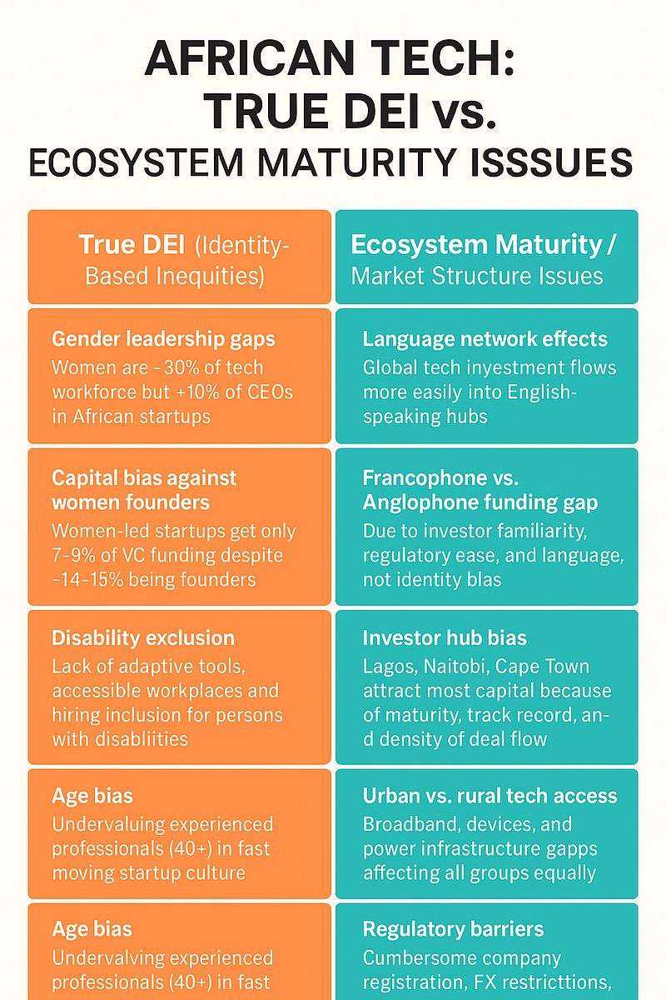

Photo by [Christina @ wocintechchat.com](https://unsplash.com/@wocintechchat?utm_source=medium&utm_medium=referral) on [Unsplash](https://unsplash.com?utm_source=medium&utm_medium=referral)

### DEI in African Tech: What’s Real, What’s Not, and Why It Matters

**By Mikey San**

### The Event That Sparked This Thought

Today, I came across a post from **CHAOSS Project Africa** on X. They were counting down to their upcoming event in Lagos on August 13th, promising conversations around *open source project health metrics, DEI, sustainability,* and more.

The mention of DEI caught my attention. Not because I’m against the idea — but because I’ve always wondered how it fits into the African tech conversation.

Tech on our continent is still relatively young. DEI, on the other hand, feels like a topic that’s been shaped by much older, more established tech ecosystems elsewhere. Was I missing something? Or was this just another example of taking a Western corporate conversation and trying to fit it onto a very different landscape?

That little question is what set me off down this rabbit hole.

### Defining DEI in an African Tech Context

Before we get into the weeds, let’s strip the jargon back.

- **Diversity**: Having different genders, ages, ethnicities, abilities, and perspectives represented in the tech workforce.
- **Equity**: Making sure access to opportunities, capital, and leadership roles is fair — not stacked in favour of one group.
- **Inclusion**: Ensuring all groups feel supported, valued, and able to contribute fully.

In the West, DEI often comes from a place of repairing past wrongs — fighting racial segregation, pushing for gender equality in leadership, dismantling workplace discrimination.

In Africa? The picture’s different. We didn’t have a “tech old boys’ club” 50 years ago because… well… we didn’t really have a tech industry at all. So if DEI applies here, it has to be in our own context — not just copy‑pasted from Silicon Valley HR manuals.

### The Numbers: Africa vs. the Rest

Past five years, the figures tell us:

**Women in tech workforce**

- Africa: ~30%
- US/EU: ~25–35%

**Female tech founders**

- Africa: ~14–15%
- US/EU: ~15%

**Female CEOs in start-ups**

- Africa: ~9–10%
- US/EU: ~15–20%

**VC funding to female-led start-ups**

- Africa: ~7–9%
- EU: ~2–3%
- US: ~2%

At **entry level**, Africa’s numbers are not dramatically worse than the global average. But at **leadership and funding** levels, the gap is still wide.

### Where DEI Really Matters in African Tech

If we stick to DEI’s actual meaning — inequities linked to identity — here’s where it’s relevant:

- **Gender leadership gaps**: Women make up nearly a third of Africa’s tech workforce but less than 10% of CEOs.
- **Capital bias against women founders**: Women-led start-ups get only a fraction of the funding available to men.
- **Disability exclusion**: Few accelerators, training programs, or employers are set up for persons with disabilities.
- **Ethnic or tribal bias in hiring**: Some founders still hire mainly from their own ethnic networks.
- **Age bias**: Older professionals (40+) are often passed over in favour of younger start-up talent.

These are identity-based gaps — and they deserve targeted, deliberate fixes.

### Where DEI Gets Misapplied

Then there are the things often filed under “DEI” that really aren’t about identity at all.

- **Francophone vs. Anglophone funding gap**: English is the global language of tech investment. Investors lean towards English-speaking hubs like Nigeria, Kenya, and South Africa — not because they dislike Francophone founders, but because it’s easier to operate in English.
- **Urban vs. rural tech access**: Poor broadband, patchy electricity, and limited devices block participation — for *everyone* in those areas.
- **Investor hub bias**: Nairobi, Lagos, and Cape Town get most of the capital because of their track records and networks.
- **Regulatory barriers**: Complicated registration processes, FX restrictions, and tax headaches push investors towards easier markets.
- **Global dominance of English**: Founders pitching in English connect faster with global capital.

These are **ecosystem maturity** and **market structure** challenges. Fixing them takes policy changes, infrastructure investment, and cross‑border collaboration — not diversity workshops.

**True DEI (Identity-Based Inequities)**

- **Gender leadership gaps** — Women are ~30% of tech workforce but &lt;10% of CEOs.
- **Capital bias against women founders** — Women-led startups get only 7–9% of VC despite ~15% being founders.
- **Disability exclusion** — Lack of adaptive tools and accessible workplaces.
- **Ethnic/tribal bias in hiring** — Hiring from own ethnic group limits diversity.
- **Age bias** — Excluding experienced professionals in favour of youth culture.

**Ecosystem Maturity / Market Structure Issues**

- **Language network effects** — English-speaking hubs attract more investment.
- **Francophone vs. Anglophone funding gap** — Investor familiarity, regulatory ease, not identity bias.
- **Investor hub bias** — Lagos, Nairobi, Cape Town dominate because of maturity and networks.
- **Urban vs. rural tech access** — Infrastructure gaps affect all equally.
- **Regulatory barriers** — Policy and bureaucracy slow investment.

**Infographic: True DEI vs. Ecosystem Issues**

### Why This Distinction Matters

If we confuse *market structure gaps* with *true DEI inequities*:

- We risk fixing the wrong problems with the wrong tools.
- We waste resources.
- We allow real identity-based inequities to be drowned out by unrelated debates about “fairness” that are actually about market maturity.

### So, What Should We Do?

1. **Target DEI where it’s real** — mentorship for women leaders, accessible training for disabled workers, anti‑bias hiring practices.
2. **Tackle market structure issues separately** — harmonise regulations, build bilingual investor networks, invest in infrastructure.
3. **Shape our own definitions** — DEI in Africa should reflect our context, not just copy global talking points.

### Final Thought

African tech is young. That’s both a challenge and a gift.

We have gaps to close, yes. But we also have the rare opportunity to shape our ecosystems from the ground up — to avoid importing the entrenched inequities and culture wars of older tech markets.

So let’s keep DEI where it belongs: focused on identity-based fairness. And let’s stop calling every market gap a “diversity issue.” Not every barrier is bias — and not every imbalance is discrimination.
