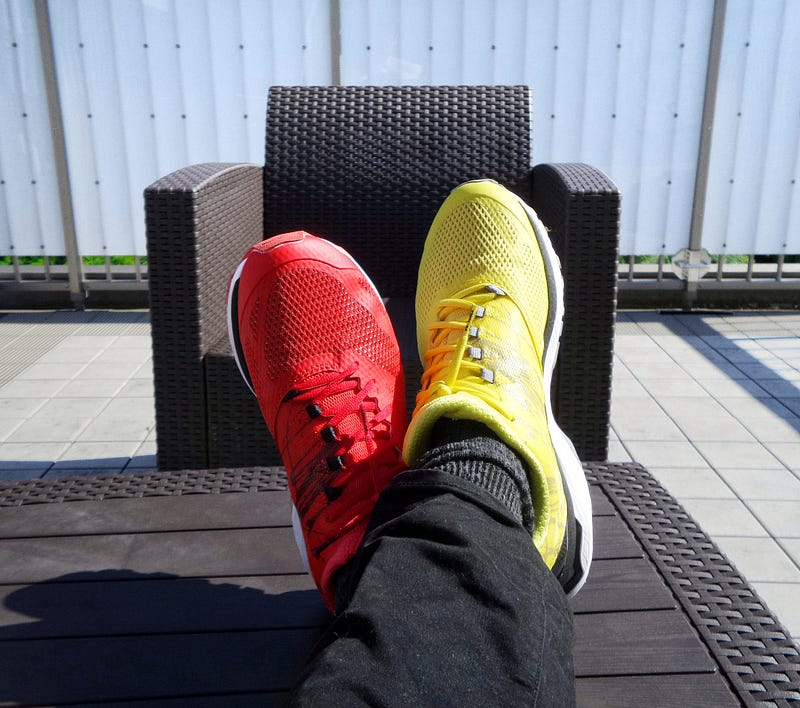

### Have You Been There?

Photo by [Florian Olivo](https://unsplash.com/@florianolv?utm_source=medium&utm_medium=referral) on [Unsplash](https://unsplash.com?utm_source=medium&utm_medium=referral)

**Been where you ask?**

You bought that Udemy course because you finally wanted to commit to learning that language. Then a few weeks in and you lose momentum.  
In that state of limbo, you spot a deal on Udemy (again). You tell yourself “this is the one. This is the one I will follow to the end”. And so you sign up for it.

You’re finally going full swing. You’re learning. The more you learn the more you want to share about your journey; not in a blog, mind.   
You want like-minded people to talk to, and learn with, as your instructor encourages. You join a community on Discord. Everyone is excited.

Life is wonderful!

Photo by [Simon Berger](https://unsplash.com/@8moments?utm_source=medium&utm_medium=referral) on [Unsplash](https://unsplash.com?utm_source=medium&utm_medium=referral)

Suddenly, everything stops. There is no motivation. The drive to continue is gone. What do you do?

This is my current state of mind. I feel bad that I cannot discipline myself to keep learning. I tell myself that it is my… \[insert really good reasons here] — for me it was a new job.  
Then I hear stories about people who started learning later than I did already working on, seemingly, big projects. I feel bad. I feel like I have failed; like shouldn’t even bother anymore. Sometimes, I feel like switching to a different language will be the key to staying focused, but I know this is a lie.

**How do I get past this phase?**

I went back to my community. I got excited again. I bought new books. I started from the beginning of the course. I started learning from a new source, YouTube, freecodecamp, etc.  
This works for some time, and I keep going; this time for months. I even start ‘building’ my own projects; following YouTube tutorials. I get stuck; usually because the video is old and things have moved on.

Now I must continue, somehow, or abandon the project. “This is a great place to be, because if I push on I will learn more.” I tell myself.   
The problem here is that the project I was following uses concepts I haven’t learned yet, so I start feeling like I know nothing at all. And like before, I give up.

Photo by [Nik Shuliahin 💛💙](https://unsplash.com/@tjump?utm_source=medium&utm_medium=referral) on [Unsplash](https://unsplash.com?utm_source=medium&utm_medium=referral)

**What should I do?**

The more I thought about this cycle, the more I realized that I had forgotten WHY I was learning to code. I had also forgotten why I picked Python as the language to start with. This profound realisation forced me to really examine what was preventing me from going beyond a few days, weeks or months; forgetting everything and starting afresh.

One possible drawback is that too many online examples focus on Web development, which is not why I started learning Python.

Another obstacle is that most (if not all) seasoned coders on YouTube and Coding Bootcamps will tell you to start a personal project, but who really knows where to start from. It is fantastic advice, and well worth pursuing; especially if your focus is web development or mobile apps — a lot of videos are geared towards these paths. You will be able to find other resources to help you when you are stuck.

Photo by [Daniel Korpai](https://unsplash.com/@danielkorpai?utm_source=medium&utm_medium=referral) on [Unsplash](https://unsplash.com?utm_source=medium&utm_medium=referral)

For all other project types, though, you should join a community. Being part of a community helps when you are stuck or when you need a boost in motivation. This is even better, when it is a community made up of people following the same course/training/tutorial as you.

Other things I discovered were holding me back were, what I call, “Coding distractions”. These are coding projects that take you away from learning. For example, you just completed a module on “list” and “dictionaries” and now you want to follow a tutorial on creating a discord bot (true story :-) ).

Sure, I could sort of follow along and understand what’s happening (for the most part). However, once I hit an error, everything falls apart, because the answers I find are usually more confusing than the error itself.

Photo by [Possessed Photography](https://unsplash.com/@possessedphotography?utm_source=medium&utm_medium=referral) on [Unsplash](https://unsplash.com?utm_source=medium&utm_medium=referral)

**What has made the difference this time?**

I have come to agree with the sentiment of learning in public. Learning in public is where you talk to others in your community about your progress, blog about it, or even tweet about it. In the past I have shied away from this aspect of learning, because I was afraid of failing. However, it has been a powerful force in shaking me awake, and to get back on track.

I have struggled, and I am sure there are others who have/are struggling too, so I hope my story helps you realise you are not alone.

\- Find a course that resonates with you. The one I am on now and determined to complete is “[100 Days of Code: The Complete Python Pro Bootcamp](https://www.udemy.com/course/100-days-of-code/)”.  
\- Find your reason for learning to code.  
\- Find a community of like-minded learners — I joined the one associated with the course above.  
\- Avoid distractions (not the social media type).  
\- Learn in public.

I hope my thoughts and tips help you.
