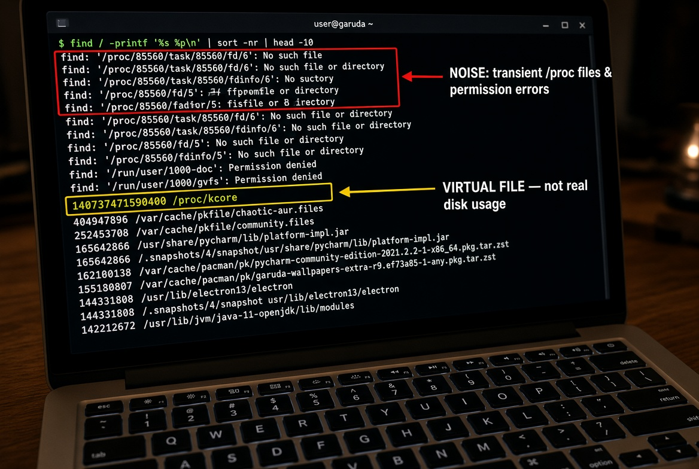
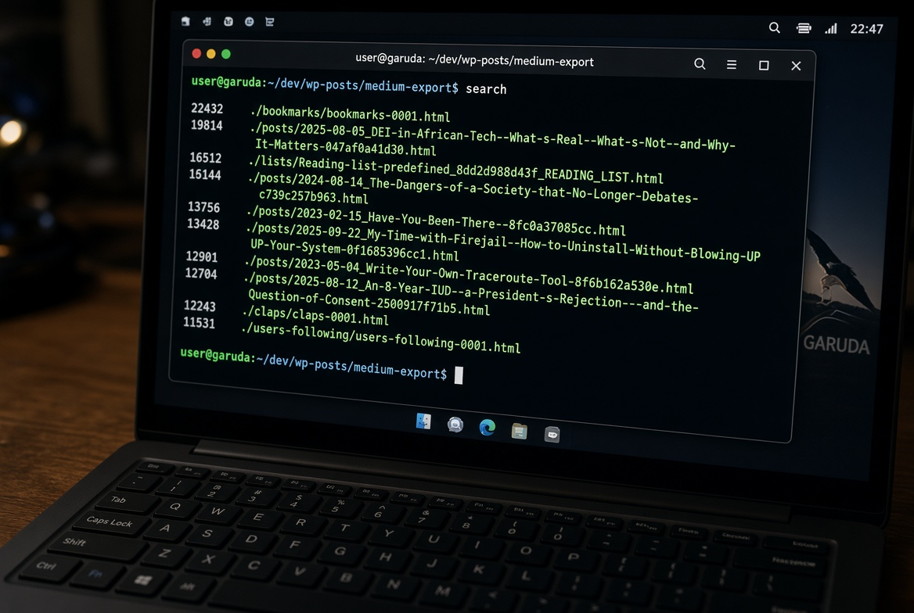

A disk fills up. You need to know what's eating it, and you need to know now. There are a dozen ways to work that out, and you will have forgotten all of them by the time it happens again.

That's roughly where I found myself recently: digging through search results for the hundredth time, taking the good bits from each. What follows is the result. Partly for anyone else who lands here, mostly as a post-it note for myself.


*Photo by [Ilya Pavlov](https://unsplash.com/@ilyapavlov?utm_source=unsplash&utm_medium=referral&utm_content=creditCopyText) on [Unsplash](https://unsplash.com/photos/monitor-showing-java-programming-OqtafYT5kTw?utm_source=unsplash&utm_medium=referral&utm_content=creditCopyText)*

## The quick one

```bash
du -a . | sort -nr | head -n 10
```

Read it left to right: give me the size of everything in this directory, sort it numerically, largest first, then stop after ten.

Broken down by command:

**`du`**
- `-a` — include individual files, not just directory totals

**`sort`**
- `-n` — sort numerically rather than as text, so 100 beats 99
- `-r` — reverse the order, putting the largest at the top

**`head`**
- `-n 10` — print ten lines and stop

Swap the `.` for a path to aim it somewhere specific — `du -a /home/user | sort -nr | head -n 10`. And if bytes are hard on the eyes, `du -ah . | sort -rh | head -n 10` gives you human-readable sizes, with `sort -h` clever enough to know that 2G outranks 900M.

## The one I actually use

```bash
find . -type f -printf '%s %p\n' | sort -nr | head -10
```

On the surface, no different from `du -a`. With one adjustment, though, it fixes a pet peeve of mine.

Here's the peeve:

```console
$ find / -printf '%s %p\n' | sort -nr | head -10
find: ‘/proc/85560/task/85560/fd/6’: No such file or directory
find: ‘/proc/85560/task/85560/fdinfo/6’: No such file or directory
find: ‘/proc/85560/fd/5’: No such file or directory
find: ‘/proc/85560/fdinfo/5’: No such file or directory
find: ‘/run/user/1000/doc’: Permission denied
find: ‘/run/user/1000/gvfs’: Permission denied
140737471590400 /proc/kcore
404947896 /var/cache/pkgfile/chaotic-aur.files
252453708 /var/cache/pkgfile/community.files
165642866 /usr/share/pycharm/lib/platform-impl.jar
165642866 /.snapshots/4/snapshot/usr/share/pycharm/lib/platform-impl.jar
162100138 /var/cache/pacman/pkg/pycharm-community-edition-2021.2.2-1-x86_64.pkg.tar.zst
155180807 /var/cache/pacman/pkg/garuda-wallpapers-extra-r9.ef73a85-1-any.pkg.tar.zst
144331808 /usr/lib/electron13/electron
144331808 /.snapshots/4/snapshot/usr/lib/electron13/electron
142212672 /usr/lib/jvm/java-11-openjdk/lib/modules
```

All that noise at the top. Worse, `/proc/kcore` walks in at 140TB and takes the top slot — it's a virtual window onto system memory, not a file on your disk, and it will never be the thing you're looking for.



The obvious fix is to prune the offending paths by name:

```bash
find / -not \( -path /proc -prune \) -not \( -path /run -prune \) -printf '%s %p\n' | sort -nr | head -10
```

That works, and it's where I started. But it has a trap waiting: the path you prune has to match the path `find` actually builds. Start from `.` instead of `/` and `find` produces `./proc/...`, which `-path /proc` will never match. The prune silently does nothing and you're back where you began.

So skip the name matching entirely:

```bash
find / -xdev -type f -printf '%s %p\n' 2>/dev/null | sort -nr | head -10
```

`-xdev` tells `find` to stay on one filesystem. `/proc`, `/sys` and `/run` are all mounted separately, so they disappear without you naming a single one — and it keeps working no matter which directory you start from. `-type f` restricts results to actual files, which stops directories elbowing their way into a list of largest files. `2>/dev/null` mops up whatever permission errors remain.

```console
$ find / -xdev -type f -printf '%s %p\n' 2>/dev/null | sort -nr | head -10
23588364288 /home/sspade/\.PHYSICALDRIVE1
6594462816 /usr/share/ollama/.ollama/models/blobs/sha256-dec52a44569a2a25341c4e4d3fee25846eed4f6f0b936278e3a3c900bb99d37c
4183948864 /usr/share/ollama/.ollama/models/blobs/sha256-9835c690d5f2e0a3aef767a57efa1cb65ca5b70745393b3e4c47f88a7594a1cf
2019377376 /usr/share/ollama/.ollama/models/blobs/sha256-dde5aa3fc5ffc17176b5e8bdc82f587b24b2678c6c66101bf7da77af9f7ccdff
1788167824 /usr/local/lib/ollama/cuda_v12/libggml-cuda.so
1128430816 /home/sspade/dev/ogeka/src-tauri/target/debug/libogeka_lib.a
1128099394 /home/sspade/dev/ogeka/src-tauri/target/debug/deps/libogeka_lib.a
1000520882 /home/sspade/dev/test-in-browser/src-tauri/target/debug/libtest_in_browser_lib.a
1000520882 /home/sspade/dev/test-in-browser/src-tauri/target/debug/deps/libtest_in_browser_lib.a
719833184 /usr/local/lib/ollama/cuda_v12/libcublasLt.so.12.8.5.5
```

No errors, no `/proc`, no directories padding out the list. Ten actual files, largest first.

Two notes on the output. The sizes are in bytes; `%k` gives you disk space instead, measured in 1K blocks. Those aren't the same number — `%s` is the file's apparent size, `%k` is what it actually occupies once the filesystem has rounded things up. For the same reason, `du` and `find` will disagree with each other. `du` reports disk usage, `find -printf '%s'` reports apparent size, and on sparse files or a directory full of tiny ones the gap gets wide. Neither is wrong. They're answering different questions.

One more: `-printf` is a GNU extension. It's on every mainstream Linux distribution, but if you wander onto macOS or BSD you'll need `gfind`, or fall back to `du`.

## Make it a single word

Typing that out every time defeats the purpose. Wrap it:

```bash
alias search="find . -xdev -type f -printf '%s %p\n' 2>/dev/null | sort -nr | head -10"
```

Now `search` lists the ten largest files in whatever directory you're standing in.

```console
$ cd ~/dev/wp-posts/medium-export
$ search
22432 ./bookmarks/bookmarks-0001.html
19814 ./posts/2025-08-05_DEI-in-African-Tech--What-s-Real--What-s-Not--and-Why-It-Matters-047af0a41d30.html
16512 ./lists/Reading-list-predefined_8dd2d988d43f_READING_LIST.html
15144 ./posts/2024-08-14_The-Dangers-of-a-Society-that-No-Longer-Debates-c739c257b963.html
13756 ./posts/2023-02-15_Have-You-Been-There--8fc0a37085cc.html
13428 ./posts/2025-09-22_My-Time-with-Firejail--How-to-Uninstall-Without-Blowing-Up-Your-System-0f1685396cc1.html
12901 ./posts/2023-05-04_Write-Your-Own-Traceroute-Tool-8f6b162a530e.html
12704 ./posts/2025-08-12_An-8-Year-IUD--a-President-s-Rejection---and-the-Question-of-Consent-2500917f71b5.html
12243 ./claps/claps-0001.html
11531 ./users-following/users-following-0001.html
```



Defined that way it dies with your shell session. To keep it, add the line to your shell's config file:

- **Bash** — `~/.bashrc`
- **Zsh** — `~/.zshrc`
- **Fish** — `~/.config/fish/config.fish`

Open a new terminal and it's there.

## Yes, there are nicer tools

`ncdu` gives you an interactive tree you can walk through and delete from. `dust` and `gdu` are faster and prettier. If you're on your own machine and you can install things, install one of them — they're genuinely better for browsing.

But that's the catch. Everything above is already on the box, which matters at 2am when you're on a borrowed SSH session, the disk is at 99%, and there isn't enough room left to install the nicer tool anyway.
