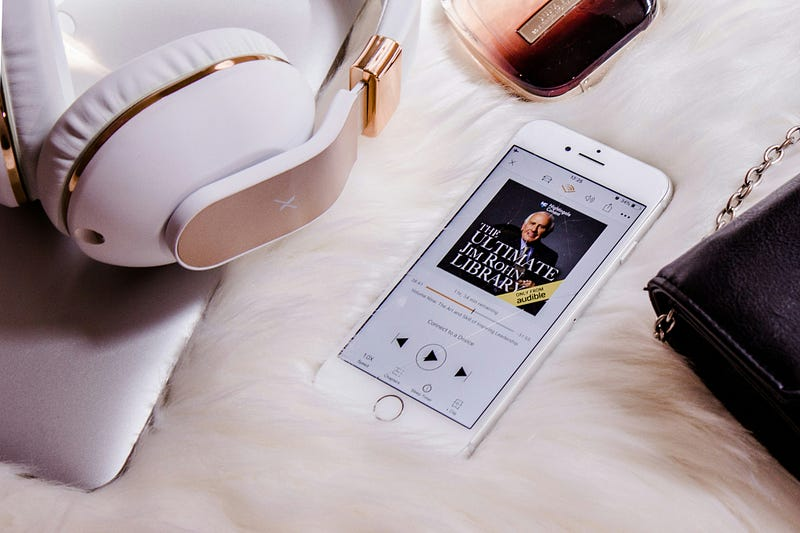

Photo by [Lena Kudryavtseva](https://unsplash.com/@lenakuld?utm_source=medium&utm_medium=referral) on [Unsplash](https://unsplash.com?utm_source=medium&utm_medium=referral)

I’ve been deep into LitRPG lately, and one thing keeps ringing true: a fantastic narrator doesn’t just speak the words — they elevate the story. These narrators have turned great books into unforgettable experiences for me, shaping not just the plot, but how I remember them.

Not every narrator does this. But some? Some don’t just match the energy of the book — they amplify it. They bring characters to life in a way that stays with you. You remember the voices, the reactions, the chaos. You hear them even when you return to the book later — in your head, they’re still there.

That’s what this post is about. Not just great books, but the voices that made them unforgettable. Here are three narrators who completely changed the game for me.

### TL;DR

- *The Primal Hunter* → **Travis Baldree**: Raw energy and full immersion
- *The Wandering Inn* → **Andrea Parsneau**: Cast depth and emotional texture
- *He Who Fights With Monsters* → **Heath Miller**: Perfect tone and rhythm

### 1. Travis Baldree — The Primal Hunter

Travis Baldree isn’t just reading your story; he’s *living* it. Whether it’s fast-paced action or quiet character beats, his delivery brings Jake’s transformation vividly to life. His energy and dynamic voice make the world feel real, immersive, and electric — even replaying scenes later still gets me hooked. ([audible.ca](https://www.audible.ca/pd/The-Wandering-Inn-Audiobook/1774240327?utm_source=chatgpt.com "The Wandering Inn Audiobook | Free with trial"), [reddit.com](https://www.reddit.com/r/litrpg/comments/13ede7u?utm_source=chatgpt.com "Best LitRPG Audiobook Narrators and what are their best books?"), [reddit.com](https://www.reddit.com/r/litrpg/comments/181g7dl?utm_source=chatgpt.com "Audiobook Recommendations?"))

### 2. Andrea Parsneau — The Wandering Inn

If you’ve ever struggled with *The Wandering Inn* as a text, give the audiobook a go. Andrea Parsneau practically *rescued* the story, bringing unique voices and emotional texture to a sprawling cast. One Reddit user put it perfectly: “the narration is so good … I don’t even notice \[the writing issues]” — she makes every character feel alive. ([reddit.com](https://www.reddit.com/r/Fantasy/comments/icc9g1?utm_source=chatgpt.com "The Wandering Inn - Audiobook is Amazing!"))

### 3. Heath Miller — He Who Fights With Monsters

Heath Miller’s narration gives this Aussie-raised LitRPG a character of its own. His voice fits Jason’s dry humour, his courage, his doubts. He nails the accent, the pacing, the tension — and keeps you glued to every chapter. The audiobooks consistently earn 5-star ratings, and it’s easy to see why.

Photo by [Massimo Messina](https://unsplash.com/@1r4?utm_source=medium&utm_medium=referral) on [Unsplash](https://unsplash.com?utm_source=medium&utm_medium=referral)

### What Makes Them Great?

1. **They build worlds** — vivid character voices, accents, pacing
2. **They elevate the writing** — giving it cinematic flair, not just reciting
3. **They linger after the last word** — their performances stay with you

A great narrator doesn’t just read a story — they *live* it — and it’s that spark that makes the difference. Who has done that for *you*?
