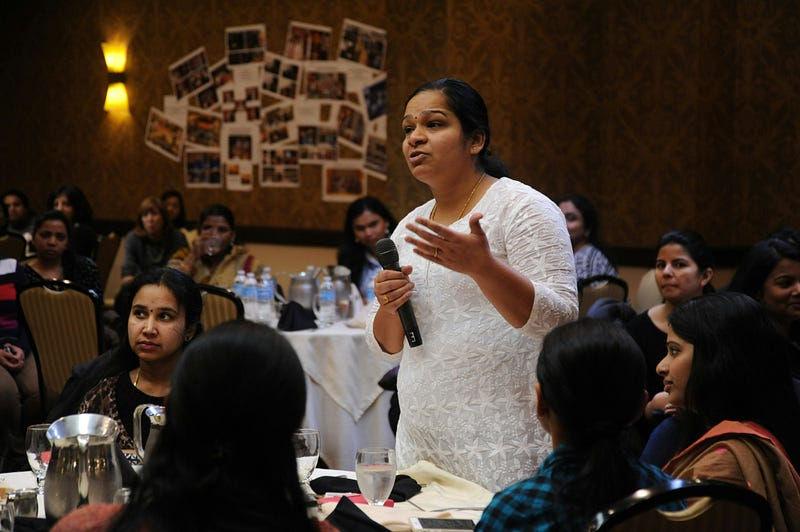
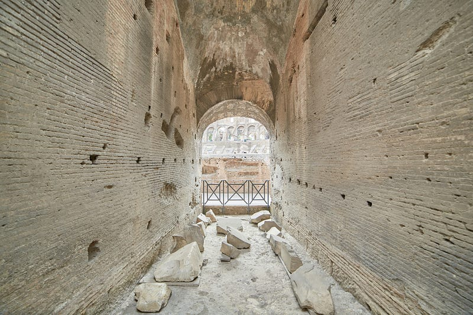
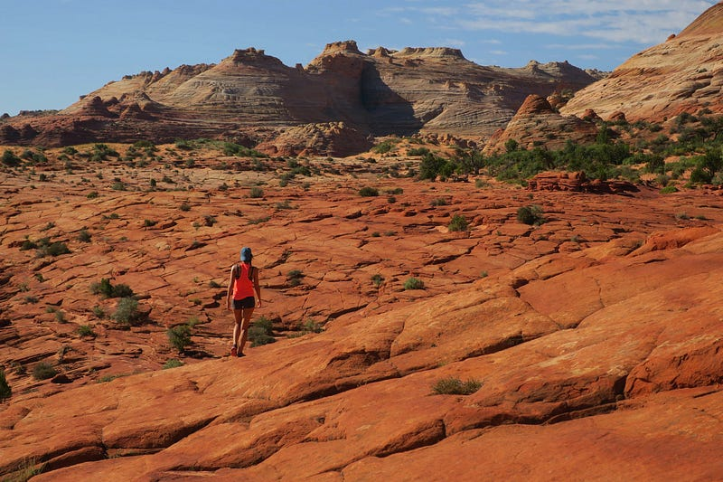

### The Dangers of a Society that No Longer Debates

Photo by [Wonderlane](https://unsplash.com/@wonderlane?utm_source=medium&utm_medium=referral) on [Unsplash](https://unsplash.com?utm_source=medium&utm_medium=referral)

### What Happened to Debating Openly

In an era dominated by social media, where complex opinions are often boiled down to a simple yes or no, the subtle art of debate is quietly fading into the background. **Why should we care?** Debate is not just about exchanging arguments; it’s a vital cog in the machinery of critical thinking, fostering understanding and driving societal progress. Without it, we’re on a slippery slope to stagnation and deepening divides. This article delves into the layered risks of a debate-deficient society, touching on its impact on democracy, social unity, and personal development.

### The Crucial Role of Debate in Society

Debate is much more than a verbal sparring match; it’s a cornerstone of a thriving society. Here’s why it’s indispensable:

- **Cultivating Critical Thinking:** Debates hone our analytical skills. They compel us to scrutinise arguments, spot biases, and articulate our viewpoints.
- **Bolstering Democracy:** Debate nurtures a well-informed populace that can engage robustly with public issues, ensuring that governments remain accountable.
- **Building Empathy:** Exposing ourselves to opposing views helps us develop empathy for those who see the world differently.

### The Rise of Echo Chambers

Photo by [Mathew Schwartz](https://unsplash.com/@cadop?utm_source=medium&utm_medium=referral) on [Unsplash](https://unsplash.com?utm_source=medium&utm_medium=referral)

### Social Media and Information Bubbles

As genuine debate wanes, **echo chambers** flourish, creating bubbles that only reinforce existing beliefs. The fallout from these echo chambers is significant:

- **Polarisation:** Communities split into factions, complicating any attempt at constructive dialogue.
- **Spreading Misinformation:** In the absence of critical scrutiny, misinformation spreads unchecked. A study by the Massachusetts Institute of Technology found that false information travels six times faster than the truth on social media.

### Case Study: The COVID-19 Pandemic

The COVID-19 crisis highlighted the peril of echo chambers. Discussions around vaccine efficacy and public health measures became highly polarised, fuelling censorship, misinformation, and eroding trust in key institutions.

### Case Study: Legislative Gridlock in the United States

A pertinent example of the dangers posed by a lack of effective debate can be observed in the legislative gridlock often seen in the United States Congress. This gridlock results when polarized opinions prevent open, constructive debate among lawmakers, leading to an inability to pass significant legislation

### The Impact on Personal Development

Debate is crucial not only for societal health but for individual growth as well. The decline in debate leads to:

- **Intellectual Stagnation:** Lacking exposure to a spectrum of ideas, people tend to settle into comfortable yet narrow worldviews.
- **Dulled Problem-Solving Abilities:** Fields like law, engineering, and policy rely on robust debate to resolve complex challenges. Without dynamic exchanges, innovation stalls.

### The Erosion of Social Cohesion

Photo by [Gert Boers](https://unsplash.com/@geboers?utm_source=medium&utm_medium=referral) on [Unsplash](https://unsplash.com?utm_source=medium&utm_medium=referral)

### Fractured Communities

The dwindling of debates is turning our communities into tribes. This tribalism leads to:

- **Diminished Tolerance:** Societies grow intolerant of dissent, fostering hostility rather than harmony.
- **Rising Conflict:** With dissent increasingly under fire, the potential for conflict escalates, damaging relationships and community spirit.

### Recent Trends in Society

Upheavals, from political protests to debates on equity and justice, illustrate this trend. Movements like “Black Lives Matter”, “MeToo”, or “Brexit” have sparked fiery debates that often descend into divisiveness, overshadowing opportunities for constructive dialogue.

### Misuse of Technology

Photo by [Google DeepMind](https://unsplash.com/@googledeepmind?utm_source=medium&utm_medium=referral) on [Unsplash](https://unsplash.com?utm_source=medium&utm_medium=referral)

### The Role of Algorithms

Technology, especially social media algorithms, plays a significant role in stifling debate. These platforms prioritise engagement over substantive discourse, leading to:

- **Amplified Extremism:** Emotionally charged content is more likely to be shared, deepening divisions and fostering misunderstanding.
- **Reduced Quality of Interactions:** Platforms like Instagram, which favour quick reactions, detract from meaningful discussion, reducing exchanges to mere sound bites rather than thoughtful discussions.

### Strategies for Counteracting These Trends

To counter the dangers discussed, both individuals and communities can adopt strategies such as:

1. **Encouraging Diverse Opinions:** Foster forums for debate that welcome diverse viewpoints, both digitally and in real life.
2. **Enhancing Media Literacy:** Equip people with the tools to critically evaluate information sources and detect biases.
3. **Fostering Debate Skills Early:** Schools should emphasise teaching students how to engage in respectful and constructive debates from a young age.

### Conclusion: The Path Forward

The fading of debate poses substantial threats to our society, individuals, and democratic processes. Moving forward, it is vital to champion the art of debate, not as a tool for division, but as a bridge to understanding and unity. **What do you think?** How can we revive the debate culture in our communities? Share your views in the comments below or join the conversation on social media.
